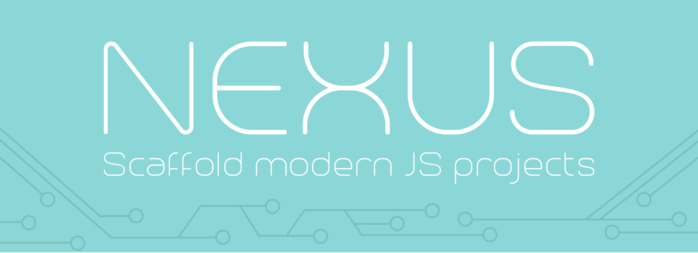

# generator-nexus 

_A starter kit for modern JS projects_

Nexus is a [Yeoman](http://yeoman.io) generator for scaffolding modern JS projects (npm packages and web apps). Although each JS project is different, a lot of tooling overlaps, so Nexus has a consistent "core" which can be customized and extended. It lays down cutting-edge best practices and boilerplate setup in seconds so that you can focus on the unique parts of your project. Nexus has been built in a modular way so that as the industry moves to new technology choices, the generator options will be updated to match.

---

## Getting Started

1. `npm install -g generator-nexus`
1. `yo nexus` in an empty directory
1. Answer the prompts and wait for everything to be installed
1. `npm run dev`

---

## Behind the scenes

Each project uses ES6 (via Babel)

### Core

Each project gets a "core" set of of files and folders, which are customized based on answers to the generator prompts:

- `src/`
  - Boilerplate code wire up
- `dist/`
  - Public code _(automatically built from `src/` directory when running `npm run dev`)_
- `.gitignore`
- `package.json`
- `README.md`

### Optional

- Editor config (EditorConfig)
- Continuous Integration config (Travis CI)
- Linting config (ESLint)
- Testing config (Mocha)
- React bundling and hot reloading (Webpack) _(only added when choosing web app (React) project type)_

---

### Roadmap

- [x] `v1.0.0` release
- [ ] Add `JS package (React)` option _(for building stand-alone React components to be published and shared, not as part of an app)_
- [ ] Update `dev` script to watch linting and tests, not just the build script _(when `testing` and/or `linting` options are selected)_
- [ ] Add npm package for extending `.eslintrc`, so that rules can be updated across projects in one place _(when `linting` option is selected)_
- [ ] Add isomorphic routing option (flatiron director) _(when `app` option is selected)_
- [ ] Add isomorphic React rendering option _(when `app` option is selected, so that apps can be run for real, not just with `webpack-dev-server`)_
- [ ] Add continuous deployment option (Heroku) _(when `app` and `travis ci` options are selected)_
- [ ] Add Flux option (Redux + Redux Dev Tools) _(when `app` option is selected)_
- [ ] Add styling reset/theme option (React inline styles) _(when `app` option is selected)_
- [ ] When Node v4.0.0 is released, update `engine` in `package.json`, and use ES6 in `webpack.config.js`

---

### Contributing

Contributions are welcome! Just follow these steps:

1. Clone
1. `npm install`
1. `npm run dev`
1. Follow code style in project
1. Ensure test coverage for any changed functionality
1. Submit a pull request

---

### License

MIT
